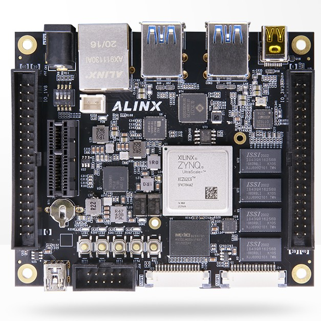
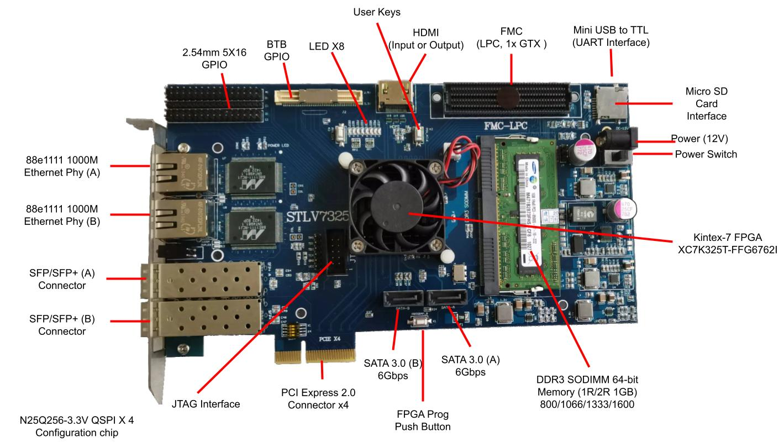

# Board Files

> **Xilinx Vivado / ISE Board Files that Supported by NeuralChip**

## Vivado Boards

### Alinx AXU2CG (Zynq MPSOC Eval Board)

> **Alinx AXU2CG AI Board**

### K7HPC (Kintex 7X335 PCIe Board)

> **Aliexpress STLV-7325 User Consumer Board**

